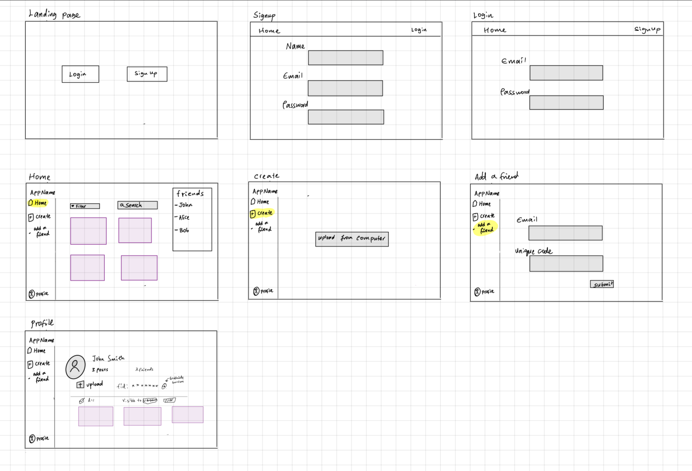

# CliquePix 

## Overview

Have you ever tried to share photos with just your close friends but ending up with random people viewing them? And don’t get us started on digging through endless feeds to find *that* one photo from the last outing. Sooo... that’s where **CliquePix** comes in!

CliquePix is your go-to app for sharing photos  with only your inner circle—think best friends only! Here, friends connect by sharing unique friend codes (f-keys), so you get to decide exactly who sees what. You can tag friends, add personalized access settings, and even filter by friends or memories to keep things organized. It’s like having a VIP club for your favorite moments, all in one super easy app!

## Data Model

The application will store **Users**, **Friends**, and **Media**.

* **Users** can have multiple friends (via references). Each friend is associated with an “f-key” that allows users to establish private connections.
* Each **User** can upload multiple media items (via references).
* Each **Media** item can have access permissions set for multiple friends (via references), allowing the user to specify who can view each photo or video.

Here’s a tentative User and Media schema in **CliquePix**:

**Example User:**

```javascript
{
  username: "johndoe123",
  hash: // a password hash,
  f_key: "john's-unique-key",
  friends: [ // array of references to other User documents
    { friendId: ObjectId("609d1b1f1c4b2e0015e8b456"), f_key: "friend's-f-key" },
  ],
  media: [ // array of references to Media documents
    ObjectId("60ae1b1f2c4b2e0015e8b567"),
  ],
  createdAt: // timestamp
}
```

**Example Media with Access Permissions:**

```javascript
{
  user: ObjectId("609d1b1f1c4b2e0015e8b456"), // reference to the User who uploaded the media
  type: "image", // type could be "image" or "video"
  url: "../backend/uploads/image.jpg", // link to media in backend/uploads
  accessList: [ // array of User references who can view the media
    ObjectId("609d1b1f1c4b2e0015e8b789"),
    ObjectId("609d1b1f1c4b2e0015e8b890"),
    // more friend references with access...
  ],
  createdAt: // timestamp
}
``` 

In this structure:
- **Users** have an **f_key** for adding friends.
- **Media** items contain a list of **accessList** references to Users with permissions to view that item.


## [First Draft Schema](backend/db/db.mjs) 

## Wireframes

- **/landing** - Landing page with options for Login and Sign-up.
- **/signup** - Sign-up page with fields for Name, Email, and Password.
- **/login** - Login page with fields for Email and Password.
- **/home** - Main home page with options to filter, search, and view friends. Displays media posts in a grid format.
- **/create** - Page for uploading media, allowing users to upload images or videos from their computer.
- **/add-friend** - Page to add a friend by entering their email and a unique friend code.
- **/profile** - Profile page showing the user’s name, friend count, and posts. Allows for media upload and options to filter media by visibility.




## Site map

- **Landing** → **Login** / **Sign-up**
- **Sign-up** → **Home**
- **Login** → **Home**
- **Home** → **Create** / **Add a Friend** / **Profile**
- **Create** → **Home**
- **Add a Friend** → **Home**
- **Profile** → **Home**

Description:
1. **Landing Page**
   - Links to **Login** and **Sign-up** pages

2. **Sign-up Page**
   - Redirects to **Home** page upon successful registration

3. **Login Page**
   - Redirects to **Home** page upon successful login

4. **Home Page**
   - Links to:
     - **Create** page (for uploading media)
     - **Add a Friend** page (for adding friends by email and unique code)
     - **Profile** page (for viewing user profile and posts)
   - Allows navigation to friend profiles (noted in the "Friends" list)

5. **Create Page**
   - Links back to **Home** page upon successful media upload

6. **Add a Friend Page**
   - Links back to **Home** page after adding a friend

7. **Profile Page**
   - Links back to **Home** page

## User Stories or Use Cases

1. As a non-registered user, I can create a new account by signing up with my name, email, and password.
2. As a user, I can log in to the site using my email and password.
3. As a user, I can view my **Home** page, where I see posts from friends and a list of my connected friends.
4. As a user, I can upload photos by navigating to the **Create** page.
5. As a user, I can add new friends by entering their email and unique friend code on the **Add a Friend** page.
6. As a user, I can filter posts on the **Home** page based on criteria.
7. As a user, I can view my **Profile** page, where I can see all my uploaded posts, edit access list for each post.
8. As a user, I can log out of the application securely from any page.


## Research Topics

1. **(4 points) Using partials on handle bars**
   * Handlebars is great and all, but its ability to embed different HTML for pages and subpages is somewhat limited. To address this, I’m exploring **partials**, which are reusable snippets of HTML that can be dynamically inserted into templates. Partials allow for modularizing the code, making it easier to maintain and more flexible when rendering components like headers, footers, or other shared sections across multiple pages. 
   <!-- * Register and login pages can be found here: -->
     <!-- - [Register Page](add sth here when done)
     - [Login Page](add sth here ) -->


2. **(6 points) Integrate Multer for media uploads**
   * I’ll use Multer to handle image and video uploads within the application. This will simplify file handling on the server and allow for smooth processing of media files. If I encounter limitations, I may consider switching to Google Cloud Storage.
   * I plan to implement upload and retrieval functionality, enabling users to seamlessly upload and access media files through the application. 


## [Link to Initial Main Project File](app.mjs) 

## Annotations / References Used

1. [MERN Stack Project Structure: Best Practices](https://dev.to/kingsley/mern-stack-project-structure-best-practices-2adk) 

2. [Setting Up a Full-Stack Web Development Project with React and Express](https://medium.com/@sushantkadam15/setting-up-a-full-stack-web-development-project-with-react-and-express-e835c52e3c31)

2. [Express.js](https://expressjs.com/)

3. [Facial Recognition with face-api.js](https://youtu.be/cGFKc-XRYKQ?si=wB_AHvy6rvPLQdPv)

4. [MULTER: A middleware for handling multipart/form-data, which is primarily used for uploading files](backend/routes/media.js#L15)
    - Source: [How to Upload Files in Node.js Using Express and Multer](https://youtu.be/i8yxx6V9UdM?si=S5JrvqIUd2MZeqzJ)
